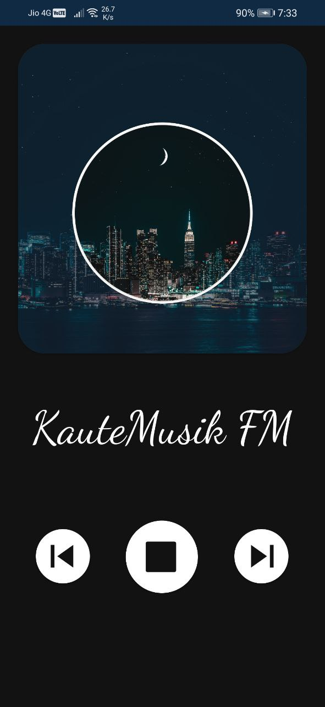

# Breezi
Breezi is a minimalistic lo-fi music player app for android. It runs in devices with Android version 5.0 (Lollipop) or above. This project is inspired by [Lofi-Player](https://github.com/Roshan-R/Lofi-Player) by [Roshan-R](https://github.com/Roshan-R)

## Sources
Breezi features radio streams from the following stations
 

| NAME | URL |
| --- | --- |
| ChillSky | https://lfhh.radioca.st/stream |
| Lauft FM | https://lofi.stream.laut.fm/lofi |
| Planet Lofi | http://198.245.60.88:8080 |
| KauteMusik FM | http://de-hz-fal-stream07.rautemusik.fm/study |
| BFlash | http://bardia.cloud:8000/stream/1/ |

## Screenshots

&nbsp &nbsp

&nbsp &nbsp

&nbsp &nbsp

## Installation
Download the source code or clone it using  
`git clone https://github.com/Abhijith-K-S/Breezi.git`

Open the project in Android Studio and create a new project from the source code

## Artwork attributions
- Brown wooden electric post under cloudy sky by [Gaspar Uhas](https://unsplash.com/@gasparuhas)
- Landscape of sea coast [Erik Mclean](https://www.pexels.com/@introspectivedsgn)
- Cottage near bank of lake [Martin Edholm](https://www.pexels.com/@martinedholm)
- Skyline photography of buildings by [Sanaan Mazhar](https://www.pexels.com/@sanaan)
- Red car parked near white wooden house by [Riley Pitzen](https://unsplash.com/@rileypitzen)
